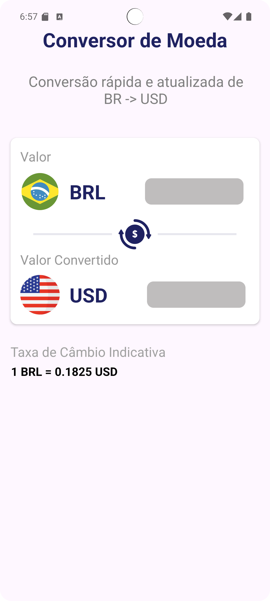

# Conversor de Moedas (BRL ↔ USD) 💱

✅ **O que é**: Um aplicativo Android simples que converte valores de Real (BRL) para Dólar (USD) em tempo real, utilizando Kotlin e View Binding. Ideal para quem quer um projeto básico para aprendizado ou uso rápido.

Este projeto é compatível com a versão estável mais recente do Android Studio.

| Funcionalidade  | Descrição                                                |
|-----------------|-----------------------------------------------------------|
| Conversão       | Entrada em BRL e conversão instantânea para USD           |
| Formatação      | Uso de `NumberFormat` para exibir moeda no padrão dos EUA |
| Entrada         | Aceita vírgula e ponto como separadores decimais          |
| Taxa de câmbio  | Configurável diretamente no código (`dollarRate`)         |

---

## 📸 Capturas de Tela

### Tela principal



### Exemplo de Conversão


---

## 🛠️ Tecnologias e Arquitetura

### Linguagem e ferramentas

- Kotlin
- Android SDK 24+
- View Binding
- `NumberFormat` para formatação monetária

### Arquitetura

- Estrutura enxuta com lógica central em `MainActivity.kt`
- Separação entre interface e lógica de cálculo
- Pronto para expandir com MVVM, Room, Retrofit ou Jetpack Compose

---

## 🎨 Inspiração de Layout

O layout da interface foi inspirado neste projeto da comunidade no Figma:  
[Currency Converter – Figma Community](https://www.figma.com/design/y2qpPh5HbNClPwgzgxZ7FI/Currency-Converter--Community-?node-id=4-25&t=cakCicm2iwl6spkk-0)

---

## 📄 Licença

Este projeto está sob a licença **MIT** – veja o arquivo [LICENSE](LICENSE) para mais detalhes.

## 💻 Como usar

1. Clone o repositório:

```bash
git clone https://github.com/<seu-usuario>/conversor-de-moedas.git
cd conversor-de-moedas
